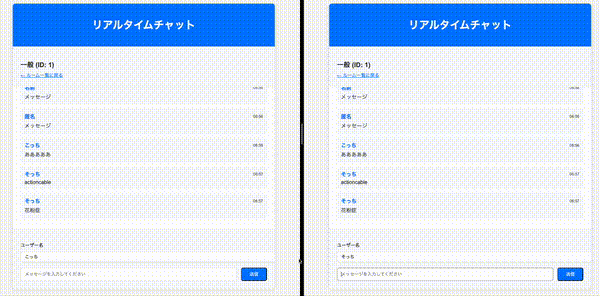

# Rails 8 Action Cable リアルタイムチャット(LT 用)

Docker で手軽に試せる WebSocket チャットアプリケーションです。  
Rails 8 の ActionCable を使い、双方向通信を簡潔に実装しています。
初学者やチャット機能を Rails で構築してみたい人向けに整理しました。

## 実行方法

1. `docker compose build`
1. `docker compose up`
1. `docker compose run web rails db:create`
1. `docker compose run web rails db:migrate`
1. アクセス: http://localhost:3000

## 詳しい説明

[doc.md](demo/notes.md)
